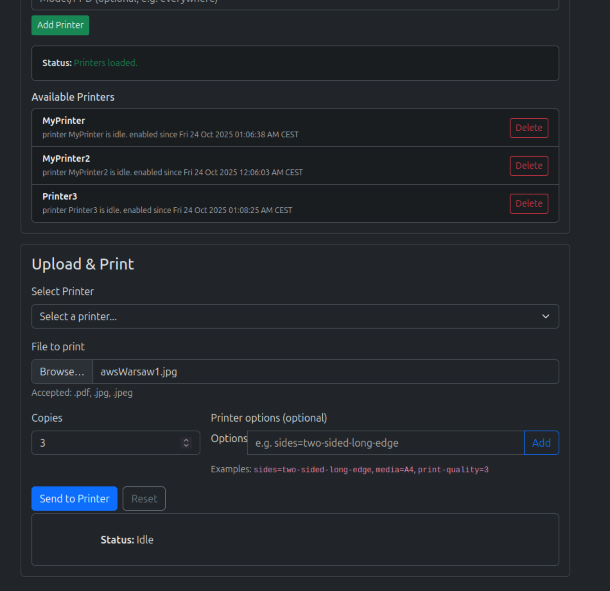

[](https://github.com/PrzemyslawSwiderski/printamos/actions/workflows/docker-push.yml)

# Printamos

## Purpose

Simple app to upload printing jobs in a home internal network with a web UI.

## Features

- Uses the [OpenPrinting CUPS](https://openprinting.github.io/cups/) tool as backend.
- Possibility to add any network/usb available printer.
- Drag & Drop files printing.
- Support for the PDF, PNG, JPG files.
- Minimal Docker Alpine image ~360MB.
- Ktor Server API.

## UI

Frontend app lets the user add the printers and print the files with
a simple select window or drag and drop.



## Docker Compose

It is possible to easily add the Printamos service as follows:

```yaml
  printamos:
    container_name: "printamos"
    image: "ghcr.io/przemyslawswiderski/printamos:latest"
    ports:
      - "8097:8080"
    volumes:
      - "printamos-data:/etc/cups"
    environment:
      PUBLIC_HOSTNAME: "printamos-example.com" # Public host name for the CSRF allowance
```

The Printamos Web UI will be available at `http://localhost:8097` on host.