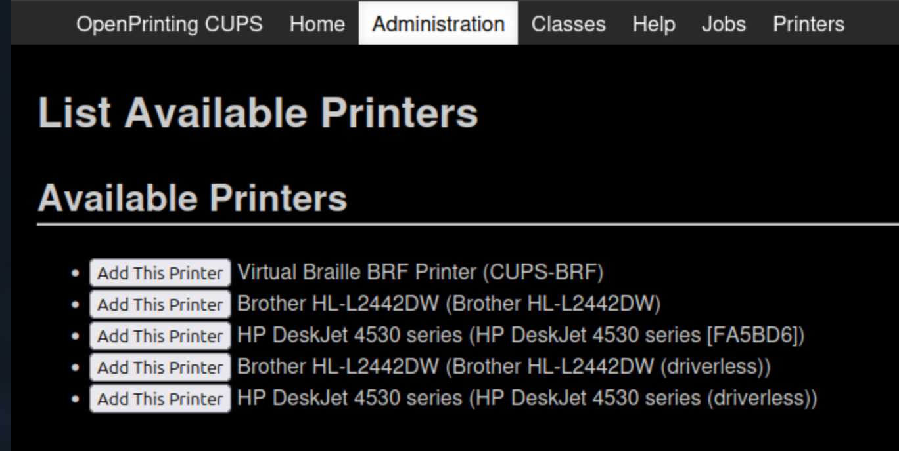

[](https://github.com/PrzemyslawSwiderski/printamos/actions/workflows/auto-release.yml)
[](https://github.com/PrzemyslawSwiderski/printamos/actions/workflows/build.yml)

# Printamos

## Purpose

Simple app to upload printing jobs in a home internal network with a web UI.

## Usage

Frontend app lets the user printing the files with a simple select window or drag and drop.


## Features

- Auto-discovers the printer with Avahi.
- Bootstrap based fully responsive styling.
- Uses the [OpenPrinting CUPS](https://openprinting.github.io/cups/) tool as backend.
- Drag & Drop files printing.
- Minimal Docker Alpine image ~400MB.
- Ktor Server API.

## Docker Compose

It is possible to add the Printamos service as follows:

```yaml
  printamos:
    container_name: "printamos"
    image: "ghcr.io/przemyslawswiderski/printamos:latest"
    volumes:
      - "printamos-data:/etc/cups"
      - "/dev/bus/usb:/dev/bus/usb"              # USB device passthrough
    network_mode: "host" # Host networking helps mDNS / Avahi discovery and IPP broadcast
    privileged: "true" # Privileged mode allows access to USB and system devices
    environment:
      PUBLIC_HOSTNAME: "printamos-example.com" # Public host name for the CSRF allowance
      TZ: "Europe/Warsaw"
      KTOR_PORT: "8097"
    restart: "always"
    tmpfs:
      - "/run" # Needed for the clean restart
      - "/tmp"

    # Optional: Restrict privileges slightly if you prefer not to use full privileged mode
    # devices:
    #   - /dev/bus/usb
    # cap_add:
    #   - SYS_ADMIN
    # group_add:
    #   - lp
    #   - lpadmin
```

then you can start it with:

```shell
docker compose up -d printamos
```

The Printamos Web UI will be available at `http://localhost:8097` on host.
Standard CUPS Admin Web UI to manage printers should be also available at `http://localhost:631`.

## Manual Printer adding

Printers can also still be manually added with standard CUPS web UI. 



## Common issues

### Printers auto-discovery not working.

Since the **host** network is needed, the mDNS connection can be blocked by its Firewall. 
Please add `5353` to allowed ports.

## [Releases](https://github.com/PrzemyslawSwiderski/printamos/releases)